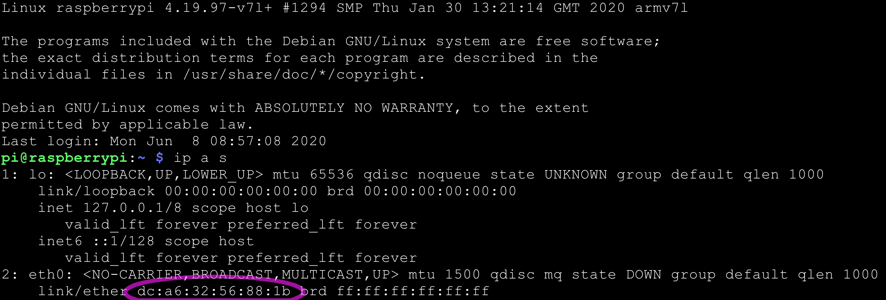

## The identity of a device

We designed Mender to manage an arbitrary number of devices. Internally the server assigns
a unique, unchangeable identifier to each one of them. The Device ID, as we call it, does not however
have a directly visible relation to any device attributes.
To address this problem we created a constant set of key-value pairs that uniquely identify a device,
that we call "Identity". 

## Mender approach to identity

MAC address of a network interface controller, serial number, eMMC CID, can all be considered
pieces of data that:
* do not change over the lifetime of a device
* are human-readable
* form a 1:1 relationship with the device
* you can store them as key-value pairs

The Mender client sends the MAC address of the primary interface as a default
identity attribute. Once you have accepted the device, you can see it in the UI:

Which corresponds to the following screen shot from a RaspberryPi:

The Mender client allows you to define the identity attributes, which means that Mender
can adapt to the identity scheme of any environment. However, Mender imposes the following
requirements for device identities:

* the combination of the attribute values must be *unique* to each device, so that identities are not ambiguous when deploying software
* identity attributes must *never change* for the lifetime of a device, so that the Mender server can recognize them reliably

Do not use device keys as part of an identity, because this makes it very difficult to
rotate or regenerate keys over the lifetime of the device (as it in effect changes the identity).
It is important to have the ability to regenerate keys if a device gets compromised, or as a recurring proactive security measure.

When a device asks for [authorization](linktotheauth) it sends along identity
attributes, based on which the Mender server determines the identity of the device.

Please refer to the [following](linktothe.05-client-configuration/03-identity) sections
to find detailed tutorial on managing the identities.
